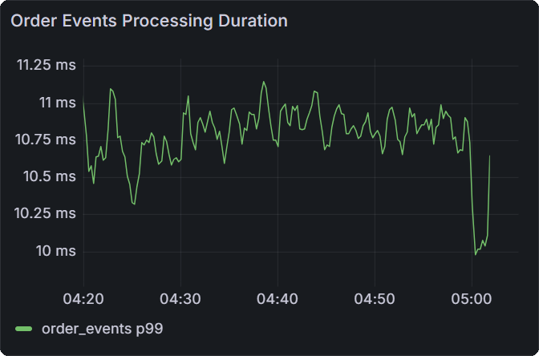
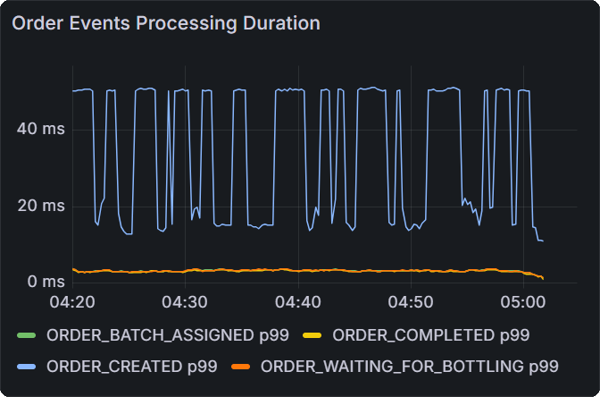

# CKC Micrometer

CKC does not force a particular observability backend on applications. The core library only calls
methods on the
[`ConsumerMetrics`](../ckc-core/src/main/kotlin/avh/ckc/core/metrics/ConsumerMetrics.kt)
implementation supplied when a consumer is created. By default, CKC uses a no-op implementation that
does nothing.

`ckc-micrometer` provides `MicrometerConsumerMetricsFactory`, which creates `ConsumerMetrics`
implementations that export those callback events as Micrometer meters: polls, record processing,
retries, commits, backpressure pauses and resumes, dropped records, failures, and live runtime gauges.

## Contents

- [Minimal Usage](#minimal-usage)
- [Tags Customization](#tags-customization)
- [Exported Metrics](#exported-metrics)
- [Public API](#public-api)
- [Filtering](#filtering)
- [Percentiles and Histograms](#percentiles-and-histograms)

## Minimal Usage

Create one `MicrometerConsumerMetricsFactory` instance per metric family configuration, bind one
`ConsumerMetrics` instance per CKC consumer, and pass that bound metrics instance to the consumer DSL:

```kotlin
val meterRegistry = SimpleMeterRegistry()

val ckcMetricsFactory = MicrometerConsumerMetricsFactory(
    meterRegistry = meterRegistry,
    metricPrefix = "myapp"
)

val orderConsumer = coroutinesKafkaConsumer<String, OrderEvent>(
    consumerProperties = orderConsumerProperties
) {
    topics("order.events")
    metrics = micrometerConsumerMetrics<String, OrderEvent>(ckcMetricsFactory)

    handle { record ->
        orderService.apply(record.value())
    }
}
```

Metric names always include the permanent `ckc` namespace after the user-defined prefix. For example,
`metricPrefix = "myapp"` records processed records with
`myapp.ckc.record.process.duration`.

## Tags Customization

The key feature of this Micrometer implementation is record-driven tag customization. It lets an
application keep a stable Micrometer/Prometheus metric schema while adding dashboard slices from
Kafka record data such as event type, tenant class, operation type, or another bounded domain value.

Suppose one Kafka topic contains all order events, but different records represent different event
types: `ORDER_CREATED`, `ORDER_UPDATED`, `ORDER_CANCELLED`, and so on. These event types may run very
different business logic and have very different processing latency. Without a custom tag, a
dashboard for `ckc.record.process.duration` can only show one aggregated latency distribution for
the whole topic. With an `event_type` tag, the same dashboard can split the latency series by event
type and make slow event classes visible.

<table>
  <tr>
    <td width="50%" valign="top">
      <strong>Without custom tags</strong><br>
      One aggregate processing latency series per topic or consumer.
    </td>
    <td width="50%" valign="top">
      <strong>With <code>event_type</code></strong><br>
      Separate latency series for each event type.
    </td>
  </tr>
  <tr>
    <td width="50%" valign="top">
      
    </td>
    <td width="50%" valign="top">
      
    </td>
  </tr>
</table>

Metric identity and tag schema are configured at the `MicrometerConsumerMetricsFactory` level:

- `metricPrefix` is mandatory and is prepended before the permanent `.ckc` segment.
- `consumer_id` is always present on CKC meters. If omitted, it uses `default`.
- `recordDrivenTagSchema` declares custom record tag keys and their default values.
- `micrometerConsumerMetrics(...)` binds one `ConsumerMetrics` instance and may provide
  record-driven extractors for declared custom tags.

In most deployments Micrometer meters are exported to Prometheus. Prometheus expects one metric
family to have a consistent set of label names. Reusing the same metric name with different custom
tag schemas across applications or factories makes dashboard aggregation fragile and can produce
invalid or dropped series. Use a unique `metricPrefix` for each application, or for each independent
metrics family when one application deliberately hosts consumers with different record-driven tag schemas.

For example, with `metricPrefix = "myapp"` the full name of `ckc.record.process.duration` becomes:

```text
myapp.ckc.record.process.duration
```

Declare custom record tag keys up front on the factory, then provide record-driven extractors when
creating the consumer metrics instance:

```kotlin
val ckcMetricsFactory = MicrometerConsumerMetricsFactory(
    meterRegistry = meterRegistry,
    metricPrefix = "myapp",
    recordDrivenTagSchema = recordDrivenTagSchema {
        tag("event_type", defaultValue = "UNKNOWN")
    }
)

val orderMetrics = micrometerConsumerMetrics<String, OrderEvent>(ckcMetricsFactory) {
    consumerId = "order_events"
    recordDrivenTagValues = recordDrivenTagValues {
        tag("event_type") { record ->
            record.value()?.type?.name
        }
    }
}
```

The schema is declared once at factory creation time. Every record-level meter created by that
factory has the same custom tag keys, even when different consumers populate different values. If an
extractor is missing or returns `null`, the tag uses the default value from the schema. If a provider
defines an extractor for a tag key that is not declared in the schema, the factory logs a warning
when the `ConsumerMetrics` instance is created and ignores that extractor.

Custom record tags are attached to metrics that observe processing, failure, age, and retry signals:

```text
ckc.record.process.duration
ckc.record.failed.duration
ckc.record.age
ckc.record.retry
```

They are not attached to poll, commit, pause/resume, runtime gauge, partition gauge, consumer
failure, or dropped-record metrics.

Reserved tag keys are owned by the factory and cannot be used as custom record tags:

```text
consumer_id
topic
error
attempt
success
reason
```

Keep custom tag cardinality bounded. Good candidates are event type, static tenant class, or another
small domain enum. Avoid raw record keys, IDs, user input, exception messages, or other unbounded
values.

## Exported Metrics

The table below shows the permanent CKC metric path. The full meter name always prepends the
user-defined `metricPrefix`; for example, `ckc.record.process.duration` becomes
`<metricPrefix>.ckc.record.process.duration`.

Meter types:

- `Counter` records a monotonically increasing count.
- `Timer` records operation durations and count.
- `Distribution summary` records distributions of numeric amounts that are not necessarily
  operation durations, such as record counts, partition counts, and offset counts.
- `Gauge` samples a current value from a live object.

Record throughput is available from timer counts. For example, successful processing throughput is
derived from the count of `myapp.ckc.record.process.duration`, and failed processing throughput is
derived from the count of `myapp.ckc.record.failed.duration`.

<table>
  <thead>
    <tr>
      <th>Metric</th>
      <th>Type</th>
      <th>Tags</th>
      <th>Description</th>
    </tr>
  </thead>
  <tbody>
    <tr>
      <th colspan="4" align="left" bgcolor="#f6f8fa">Record metrics</th>
    </tr>
    <tr>
      <td><code>ckc.record.process.duration</code></td>
      <td>Timer</td>
      <td><code>consumer_id</code>, <code>topic</code>, custom record tags</td>
      <td>User handler processing duration for successfully processed records, including configured retries before success.</td>
    </tr>
    <tr>
      <td><code>ckc.record.failed.duration</code></td>
      <td>Timer</td>
      <td><code>consumer_id</code>, <code>topic</code>, <code>error</code>, custom record tags</td>
      <td>Processing duration until a record was reported as failed.</td>
    </tr>
    <tr>
      <td><code>ckc.record.age</code></td>
      <td>Timer</td>
      <td><code>consumer_id</code>, <code>topic</code>, <code>error</code>, custom record tags</td>
      <td>Record age in milliseconds from Kafka record timestamp to processing start. Successful records use <code>error=none</code>.</td>
    </tr>
    <tr>
      <td><code>ckc.record.dropped</code></td>
      <td>Counter</td>
      <td><code>consumer_id</code>, <code>topic</code>, <code>reason</code></td>
      <td>Count of records intentionally discarded by the selected processing mode.</td>
    </tr>
    <tr>
      <td><code>ckc.record.retry</code></td>
      <td>Counter</td>
      <td><code>consumer_id</code>, <code>topic</code>, <code>attempt</code>, <code>error</code>, custom record tags</td>
      <td>Count of user handler retry attempts. <code>attempt</code> is one-based.</td>
    </tr>
    <tr>
      <th colspan="4" align="left" bgcolor="#f6f8fa">Poll metrics</th>
    </tr>
    <tr>
      <td><code>ckc.poll.duration</code></td>
      <td>Timer</td>
      <td><code>consumer_id</code></td>
      <td>Kafka <code>poll</code> call duration.</td>
    </tr>
    <tr>
      <td><code>ckc.poll.records</code></td>
      <td>Distribution summary</td>
      <td><code>consumer_id</code></td>
      <td>Number of records returned by each Kafka <code>poll</code>.</td>
    </tr>
    <tr>
      <th colspan="4" align="left" bgcolor="#f6f8fa">Commit metrics</th>
    </tr>
    <tr>
      <td><code>ckc.commit.duration</code></td>
      <td>Timer</td>
      <td><code>consumer_id</code>, <code>success</code></td>
      <td>Manual commit attempt duration. The timer count is the commit attempt count.</td>
    </tr>
    <tr>
      <td><code>ckc.commit.partitions</code></td>
      <td>Distribution summary</td>
      <td><code>consumer_id</code>, <code>success</code></td>
      <td>Number of partitions included in each commit attempt.</td>
    </tr>
    <tr>
      <td><code>ckc.commit.offsets</code></td>
      <td>Distribution summary</td>
      <td><code>consumer_id</code>, <code>success</code></td>
      <td>Number of offset positions advanced by each commit attempt.</td>
    </tr>
    <tr>
      <th colspan="4" align="left" bgcolor="#f6f8fa">Backpressure and failure metrics</th>
    </tr>
    <tr>
      <td><code>ckc.pause.resume</code></td>
      <td>Counter</td>
      <td><code>consumer_id</code>, <code>action</code></td>
      <td>Count of Kafka consumer pause or resume events caused by downstream backpressure.</td>
    </tr>
    <tr>
      <td><code>ckc.pause.resume.partitions</code></td>
      <td>Distribution summary</td>
      <td><code>consumer_id</code>, <code>action</code></td>
      <td>Number of assigned partitions passed to each pause or resume call.</td>
    </tr>
    <tr>
      <td><code>ckc.failure</code></td>
      <td>Counter</td>
      <td><code>consumer_id</code>, <code>error</code></td>
      <td>Count of unrecoverable consumer-level failures.</td>
    </tr>
    <tr>
      <th colspan="4" align="left" bgcolor="#f6f8fa">Runtime gauges</th>
    </tr>
    <tr>
      <td><code>ckc.workers</code></td>
      <td>Gauge</td>
      <td><code>consumer_id</code></td>
      <td>Configured worker count for the bound consumer runtime.</td>
    </tr>
    <tr>
      <td><code>ckc.workers.active</code></td>
      <td>Gauge</td>
      <td><code>consumer_id</code></td>
      <td>Current number of active workers.</td>
    </tr>
    <tr>
      <td><code>ckc.work.queue.size</code></td>
      <td>Gauge</td>
      <td><code>consumer_id</code></td>
      <td>Current shared work queue size.</td>
    </tr>
    <tr>
      <td><code>ckc.work.queue.capacity</code></td>
      <td>Gauge</td>
      <td><code>consumer_id</code></td>
      <td>Configured shared work queue capacity.</td>
    </tr>
    <tr>
      <td><code>ckc.work.queue.max</code></td>
      <td>Gauge</td>
      <td><code>consumer_id</code></td>
      <td>Maximum observed shared work queue size.</td>
    </tr>
    <tr>
      <td><code>ckc.ordering.queue.size</code></td>
      <td>Gauge</td>
      <td><code>consumer_id</code></td>
      <td>Current ordering queue size for ordered processing modes.</td>
    </tr>
    <tr>
      <td><code>ckc.ordering.queue.max</code></td>
      <td>Gauge</td>
      <td><code>consumer_id</code></td>
      <td>Maximum observed ordering queue size for ordered processing modes.</td>
    </tr>
    <tr>
      <td><code>ckc.offsettracker.capacity</code></td>
      <td>Gauge</td>
      <td><code>consumer_id</code>, <code>topic</code>, <code>partition</code></td>
      <td>Current bit capacity used by the assigned partition offset tracker.</td>
    </tr>
  </tbody>
</table>

`consumer_id` is always present. If `micrometerConsumerMetrics(...)` is called without an explicit
value, the factory uses `consumer_id=default`.

## Public API

`MicrometerConsumerMetricsFactory` holds the meter registry, metric name prefix, static tags, and
record-driven tag schema for a metric family:

```kotlin
MicrometerConsumerMetricsFactory(
    meterRegistry = meterRegistry,
    metricPrefix = "myapp",
    staticTags = listOf(Tag.of("service", "orders")),
    recordDrivenTagSchema = recordDrivenTagSchema("event_type")
)
```

- `meterRegistry`: Micrometer registry that receives CKC meters.
- `metricPrefix`: required user-defined prefix before the permanent `.ckc` segment.
- `staticTags`: optional tags attached to every meter created by the factory.
- `recordDrivenTagSchema`: optional schema for record-driven custom tags.

`micrometerConsumerMetrics(factory) { ... }` creates the `ConsumerMetrics<K, V>` instance passed to a
CKC consumer:

```kotlin
val metrics = micrometerConsumerMetrics<String, OrderEvent>(ckcMetricsFactory) {
    consumerId = "order_events"
    recordDrivenTagValues = recordDrivenTagValues {
        tag("event_type") { record -> record.value()?.type?.name }
    }
}
```

- `consumerId`: logical CKC consumer id; defaults to `default`.
- `recordDrivenTagValues`: optional per-consumer extractors for record-driven custom tags.

`recordDrivenTagSchema(...)` declares allowed custom record tag keys and defaults:

```kotlin
recordDrivenTagSchema {
    tag("event_type", defaultValue = "UNKNOWN")
    tag("tenant_class", defaultValue = "NONE")
}
```

`recordDrivenTagValues { ... }` declares extractor functions by tag key. Each extractor
receives the current Kafka `ConsumerRecord<K, V>` and returns a tag value or `null`.

## Filtering

If some meters are not useful for your application, filter them with Micrometer or Spring Boot rather
than adding CKC-specific per-meter enable flags.

Micrometer [`MeterFilter`](https://docs.micrometer.io/micrometer/reference/concepts/meter-filters.html):

```kotlin
registry.config().meterFilter(
    MeterFilter.denyNameStartsWith("myapp.ckc.record.retry")
)
```

Spring Boot per-meter properties:

```yaml
management:
  metrics:
    enable:
      myapp:
        ckc:
          record:
            retry: false
```

Spring Boot applies these properties to meter IDs by prefix.

See Spring Boot's
[`management.metrics.enable.*`](https://docs.spring.io/spring-boot/appendix/application-properties/index.html)
property documentation for the exact matching rules.

## Percentiles and Histograms

CKC registers duration meters as Micrometer `Timer`s. Percentiles and histogram buckets are configured
through Micrometer or through your application framework, not through the CKC adapter.

With plain Micrometer, add a `MeterFilter` to the registry before creating CKC meters:

```kotlin
import io.micrometer.core.instrument.Meter
import io.micrometer.core.instrument.config.MeterFilter
import io.micrometer.core.instrument.distribution.DistributionStatisticConfig

meterRegistry.config().meterFilter(object : MeterFilter {
    override fun configure(
        id: Meter.Id,
        config: DistributionStatisticConfig
    ): DistributionStatisticConfig {
        if (id.type != Meter.Type.TIMER || !id.name.startsWith("myapp.ckc.")) {
            return config
        }

        return DistributionStatisticConfig.builder()
            .percentilesHistogram(true)
            .build()
            .merge(config)
    }
})
```

Client-side percentile gauges can be configured the same way:

```kotlin
meterRegistry.config().meterFilter(object : MeterFilter {
    override fun configure(
        id: Meter.Id,
        config: DistributionStatisticConfig
    ): DistributionStatisticConfig {
        if (id.name != "myapp.ckc.record.process.duration") {
            return config
        }

        return DistributionStatisticConfig.builder()
            .percentiles(0.5, 0.95, 0.99)
            .build()
            .merge(config)
    }
})
```

For Spring Boot and Prometheus, enable percentile histograms for selected CKC timers:

```yaml
management:
  metrics:
    distribution:
      percentiles-histogram:
        myapp.ckc.record.process.duration: true
        myapp.ckc.record.failed.duration: true
        myapp.ckc.poll.duration: true
        myapp.ckc.commit.duration: true
```

You can also publish client-side percentile gauges:

```yaml
management:
  metrics:
    distribution:
      percentiles:
        myapp.ckc.record.process.duration: 0.5,0.95,0.99
```

Prefer percentile histograms for Prometheus when you need aggregable percentile queries across pods
or tag values. See Micrometer's
[`Histograms and Percentiles`](https://docs.micrometer.io/micrometer/reference/concepts/histogram-quantiles.html)
documentation and Spring Boot's
[`management.metrics.distribution.*`](https://docs.spring.io/spring-boot/appendix/application-properties/index.html)
properties.
