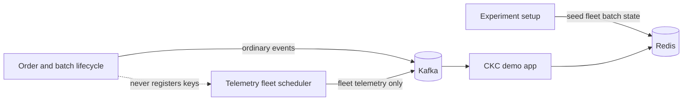

# Load Test

This module contains the Kotlin-based traffic generator for the demo domain.

Module: `ckc-demo-load-test`

Current scope:

- load scenario phases over time
- external shard identity for local runs and Kubernetes indexed jobs
- in-process generator workers with isolated simulation state
- event-generator driven order, batch, and cauldron publishers over one base TPS

It is intended to grow into the main load-test entry point for:

- local end-to-end checks against Kafka, Redis, and demo stubs
- cloud load tests with multiple external generator shards

## Load Profile

The current load profile format is a single string, intended to be passed as an env var or CLI setting.

Example:

```text
0 -> (200s, warmup) -> 100 -> (1600s, maximum) -> 100 -> (100s, cool-down) -> 0
```

Rules:

- the profile starts with an integer percentage of `BASE_TPS`
- then alternates between `(duration, optional label)` and the next integer target percentage
- labels are kept for logging and diagnostics
- durations use compact units: `s`, `m`, `h`
- `BASE_TPS` defines total generated messages per second at profile `100` for this JVM process
- `LOAD_TEST_WORKERS` controls in-process generator workers; it defaults to available CPU cores
- workers split `BASE_TPS` across themselves and keep separate simulation state
- active worker count is capped by `BASE_TPS` so each worker has at least one integer TPS permit
- generated entity ids include both identity dimensions, for example `order-1-5-00021212`
- `ORDER_EVENT_PERCENT`, `BATCH_EVENT_PERCENT`, and `CAULDRON_TELEMETRY_PERCENT` split that total event budget across topics
- `ORDER_TPS_PER_PRODUCER`, `BATCH_TPS_PER_PRODUCER`, and `CAULDRON_TELEMETRY_TPS_PER_PRODUCER` model the peak capacity of one independently scaled producer-service instance; each defaults to `1000`
- each topic producer pool is sized once from its maximum load-profile rate using `ceil(peak topic TPS / TPS per producer)` and retains at least one producer for delegated prerequisite events
- records use stable key affinity within a topic pool so scaling the producer service does not introduce generator-side same-key reordering
- event generators use state queues when a suitable simulated entity exists and delegate prerequisite event generation while the state is warming up
- `BREWING_STEP_BURST_EVERY`, `MIN_BREWING_STEP_BURST`, and `MAX_BREWING_STEP_BURST` emit same-key `BATCH_BREWING_STEP_COMPLETED` bursts, capped by remaining batch brewing steps, so ordered-by-key contention is observable without increasing total TPS
- `TELEMETRY_SOURCE_MODE=FLEET` emits each telemetry key at `TELEMETRY_PUBLISH_INTERVAL_SECONDS` and changes the active key count to follow the requested telemetry rate
- the default `TELEMETRY_SOURCE_MODE=ACTIVE_BATCHES` keeps cauldron telemetry tied to batches that are active in the simulated business pipeline
- `PUBLISH_ENABLED=false` keeps generation and audit output enabled but skips Kafka sends for local debugging
- the load-test process flushes producers and exits when the profile schedule ends

## Telemetry Fleet

Throughput-driven experiments use a pre-seeded telemetry corpus that is separate from batches produced by the ordinary lifecycle generator. Before the measured run starts, the orchestration layer writes one `batch-state:fleet-batch-*` fixture per possible telemetry source directly to Redis. It does not publish setup events to Kafka, so corpus preparation does not affect audit totals, consumer warmup, or the measured topic mix.



For `TELEMETRY_SOURCE_MODE=FLEET`, the fleet follows these calculations:

```text
fleet size = peak telemetry messages/second × publish interval seconds
active keys = current telemetry messages/second × publish interval seconds
```

Every key has a stable owner worker, activation rank, and phase within the interval. Increasing load enables more keys; it does not shorten the interval for keys that are already active. A delayed scheduler skips expired ticks instead of sending a catch-up burst. Fleet identifiers use the `fleet-cauldron-*` and `fleet-batch-*` prefixes, so lifecycle batches cannot overwrite their Redis state or become accidental telemetry sources.

For example, 5,000 total messages/second with 40% telemetry and a five-second interval resolves to 2,000 telemetry messages/second and 10,000 fleet keys at peak load.

## Producer Metrics

The load-test process exposes Prometheus metrics at `http://0.0.0.0:9405/metrics` by default. Override the port with `LOAD_TEST_METRICS_PORT`.

Every Kafka producer is bound through Micrometer with bounded `shard`, `traffic.topic`, `producer.index`, and Kafka `client.id` dimensions. The native Kafka metrics include batch size, records per request, compression rate, record and byte throughput, queue and request latency, buffer pressure, retries, errors, and broker throttling. The endpoint also exposes:

- `ckc.load.test.producer.pool.size`
- `ckc.load.test.producer.records.sent`
- `ckc.load.test.producer.records.acked`
- `ckc.load.test.producer.records.failed`

Producer client ids use the stable form `ckc-load-test-<topic>-s<shard>-p<producer>` and do not include the run id, avoiding a new Prometheus label value for every test run.
