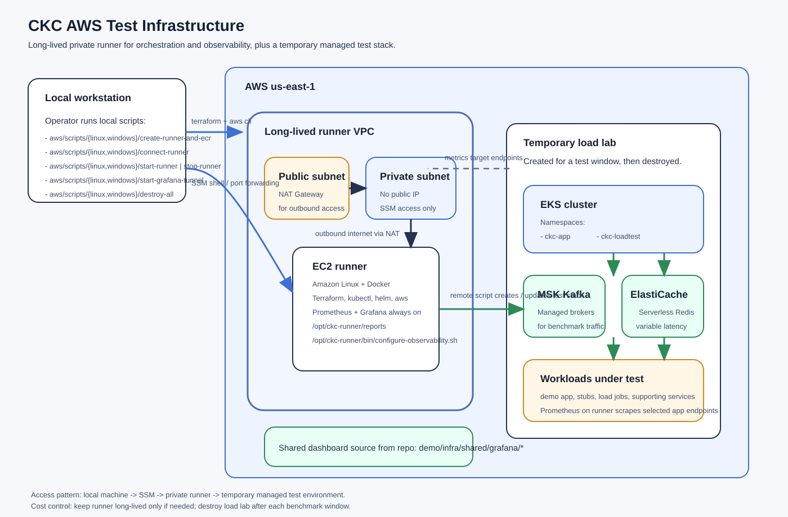

# AWS Infrastructure



`demo/infra/aws` is now split by responsibility instead of by historical module name.

## Layout

- `terraform/`
  Long-lived Terraform stacks managed from the local machine.
  This currently holds `runner/` and `ecr/`.

- `assets/`
  AWS-only files uploaded to the runner by `update-aws-lab`.
  This currently includes runner-side Terraform for disposable labs.

- `runner-assets/`
  Remote entrypoints that execute on the runner host.

- `../shared/`
  Helm charts, test definitions, and test orchestration code reused by lab flows.

- `scripts/`
  Git Bash-compatible local operator commands for creating, updating, and connecting to the runner.

## Model

- `terraform/runner`
  Creates the long-lived private EC2 runner.

- `terraform/ecr`
  Creates the long-lived ECR repositories.

- `assets/terraform`
  Defines the disposable AWS test lab synced to the runner.

- `runner-assets`
  Contains remote scripts that execute on the runner and orchestrate AWS lab lifecycle.

- `helm/`
  AWS-owned Helm charts and deployment profiles for the app and stub workloads.

- `../shared/test-definitions`
  Test-run definitions that select deployment profiles and load configuration.

- `../shared/audit`
  Shared audit analysis code. AWS audit chunks can be downloaded from S3 and analyzed from any machine with Python and AWS CLI access.

## Access Model

- The runner has no public IP.
- Shell access uses AWS Systems Manager Session Manager.
- Grafana and Prometheus-compatible storage run on the runner host.
- Outbound internet access from the runner goes through a NAT gateway.
- The runner stores lab metrics outside the disposable EKS lab. Grafana keeps the datasource name/uid `Prometheus`, backed by a VictoriaMetrics-compatible remote-write receiver on the runner.
- `create-lab` installs a Grafana Alloy agent inside EKS. Alloy discovers `ckc-demo` pods and `ckc-kafka-exporter` through the Kubernetes API, scrapes app and Kafka lag metrics, and remote-writes labelled metrics to the runner.
- AWS labs expose Kafka consumer lag through `kafka_exporter` metrics for both in-cluster Kafka and MSK. MSK profiles also start a runner-side CloudWatch exporter for managed `AWS/Kafka` lag metrics such as `MaxOffsetLag`, `SumOffsetLag`, and `EstimatedMaxTimeLag`.
- The disposable lab Terraform creates same-account VPC peering, routes, and runner security-group ingress for the remote-write path. `destroy-lab` removes that networking with the lab.

## Typical Flow

1. Create the long-lived base with local `scripts/create-runner-and-ecr.sh`.
2. Build and push images, then sync runner assets with local `scripts/update-aws-lab.sh`.
3. Connect to the runner with local `scripts/connect-runner.sh`.
4. On the runner, start `tmux` and run `runner-assets/bin/create-lab.sh`.
5. On the runner, run one or more tests with `runner-assets/bin/run-test.sh`.
6. On the runner, destroy the disposable lab with `runner-assets/bin/destroy-lab.sh` when it is no longer needed. Metrics history remains on the runner.

See [terraform/README.md](terraform/README.md) and [assets/README.md](assets/README.md).

`create-lab` flushes Redis and accepts a test definition path to recreate Kafka topics from `deployment.kafka_topics` during lab setup. If omitted, AWS uses `demo/infra/shared/test-definitions/ckc-baseline.yaml`.

## Audit Analysis

AWS audit analysis is intentionally manual and location-independent. After a run has uploaded audit chunks to S3, run the shared analyzer wrapper from a local machine, the internal lab, or the AWS runner:

```sh
./demo/infra/aws/audit/analyze-s3-audit.sh s3://bucket/prefix/run-id
```

Add `--upload-summary` to copy `summary.yaml` and `analyzer-progress.log` back to the same S3 prefix.
