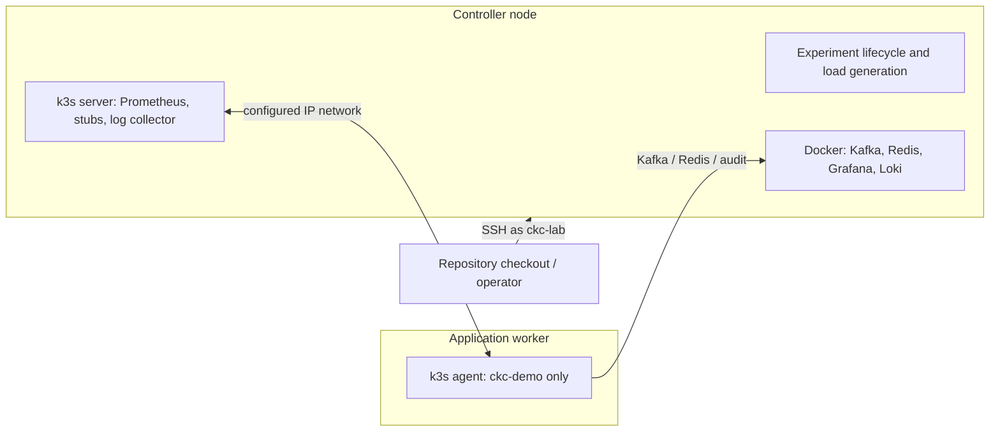

# Internal lab

The internal lab is the persistent k3s execution adapter for canonical CKC
experiments. Kafka, Redis, VictoriaMetrics, Loki, Grafana, and the audit receiver
remain installed between runs; experiment-owned application and stubs resources
are generated and replaced for each target.

## Configure and install

The operator can run the repository on the lab host, on a laptop, or on another
Linux machine with SSH access to the lab host. Start the setup wizard:

```bash
demo/infra/internal-lab/scripts/lab.sh init
demo/infra/internal-lab/scripts/lab.sh bootstrap
demo/infra/internal-lab/scripts/lab.sh up
```

`init` creates the local, untracked
`.demo-infra/internal-lab/lab.yaml`. `bootstrap` is the only normally privileged
phase: it installs the required Ubuntu packages and k3s, creates the `ckc-lab`
system user, installs its SSH key, and prepares `/opt/ckc-lab`. Docker and the
controller toolchain are installed only on the controller. `up` builds and
synchronizes the lab through `ckc-lab`; it does not SSH as root or install
packages.

For automation, configuration can be generated without prompts:

```bash
demo/infra/internal-lab/scripts/lab.sh init --non-interactive \
  --host optilab \
  --admin-user alexey \
  --lab-address 192.168.1.20 \
  --public-key ~/.ssh/id_ed25519.pub
```

The wizard supports `single-host` and `split-application`. In the split topology,
provide the worker SSH host, the address by which the controller reaches it, and
its Kubernetes node name. For example:

```yaml
version: 1
topology: split-application
network:
  application_link: direct
operator:
  public_key: /home/alexey/.ssh/id_ed25519.pub
  telegram_env: /home/alexey/.config/ckc-lab/telegram.env
runtime:
  user: ckc-lab
  root: /opt/ckc-lab
  performance_cpu_khz: 2000000
nodes:
  infra:
    host: optilab
    admin_user: root
    lab_address: 10.10.20.2
    roles: [controller, k3s-server, services]
  application:
    host: optilab2
    admin_user: alexey
    lab_address: 10.10.20.3
    k3s_name: optilab2
    roles: [k3s-agent, application]
```

Set `network.application_link` to `direct` for a dedicated cable or `lan` for
an ordinary switched or routed home network. Interface names, negotiated speed,
duplex, and actual routes are discovered at runtime rather than configured.
For a split topology, bootstrap also derives the interface used to reach the
other node from that route and persists it as k3s `flannel-iface`. This keeps
cross-node pod traffic on the configured lab addresses even when a management
or Wi-Fi interface owns the host's default route.
`bootstrap` prepares the controller first, transfers its k3s join token without
printing it, and then joins the worker. The operator key remains usable on both
hosts, while a dedicated runtime key permits controller-to-worker operations as
the unprivileged `ckc-lab` account.

In `split-application`, only `ckc-demo` is scheduled on the application worker.
Kafka, Redis, Grafana, Loki, Prometheus, stubs, test orchestration, and load
generation remain on the controller. Built images are imported into both k3s
containerd stores; no registry is required.



Generated experiment reports use the observed pod-to-node placement. A split
lab is drawn as separate controller and application-worker hosts, including
their k3s server/agent boundaries and the configured IP network between them;
single-host installations retain the compact combined topology.

After repository updates, run `lab.sh up` again (or add `--force-rebuild`). The
installed root defaults to `/opt/ckc-lab`. Configuration is under `config`,
service logs under `logs`, and run results under `results`.

`up` compares one aggregate checkout fingerprint with the installed lab before
it mutates the remote host. An unchanged checkout exits without running Gradle
or transferring files; a changed checkout synchronizes only the affected
artifacts. The demo starter and Java agent use the same `threadStatsVersion`
from `gradle.properties`. Snapshot artifacts are normally taken from the local
Maven repository; if the agent is absent there, Gradle resolves it from the
configured Maven repositories. Updating the lab never builds the neighboring
Thread Stats checkout.

The runtime user belongs to the Docker group and owns the lab files. Its only
passwordless sudo permissions are three exact no-argument helpers: image import,
CPU performance acquisition, and CPU policy restoration. Arbitrary `docker`,
`k3s`, shell, and wildcard sudo rules are deliberately not granted. Bootstrap
does not change the active CPU policy.

## Manage an experiment

Start one experiment from the repository checkout. The command updates the lab
first and returns after the user service has started; closing the terminal does
not stop the run.

```bash
demo/infra/internal-lab/scripts/lab.sh experiment start \
  demo/infra/experiments/smoke.yaml
```

Inspect or control it from any later shell in the same checkout:

```bash
demo/infra/internal-lab/scripts/lab.sh experiment status
demo/infra/internal-lab/scripts/lab.sh experiment logs
demo/infra/internal-lab/scripts/lab.sh experiment logs --follow
demo/infra/internal-lab/scripts/lab.sh experiment stop
```

`start` refuses a second concurrent experiment, and `lab.sh up` refuses to
replace runtime files while an experiment is active. Add `--no-update` only when
the installed runtime is already known to match the checkout. `status --json`
provides a machine-readable view of the current or most recent request.

The orchestrator atomically maintains
`/opt/ckc-lab/state/experiment/progress.json`. Human-readable `status` shows the
current lifecycle step, target number and name, workload elapsed time and ETA,
and the latest consumer lag while draining. Preparation, Kafka warm-up, audit
analysis, report generation, evidence collection, bundle creation, application
shutdown, completion, interruption, and failure are explicit states. The same
document is included under `progress` by `status --json` and remains available
after the service exits.

The managed user service acquires the configured CPU policy on every configured
node immediately before
the run and restores the exact previous minimum, maximum, and governor in
`ExecStopPost` after success, failure, or an explicit stop. The default experiment
frequency is 2,000,000 kHz; set `runtime.performance_cpu_khz: 0` in `lab.yaml` to
disable tuning. Turbo state is never modified.

After the final target drains, the runner deletes the application HPA and scales
both `ckc-demo` and `ckc-demo-stubs` to zero. This cleanup also runs after a
failed or explicitly stopped experiment and before its terminal notification.
The Deployment objects remain available for inspection, while Kafka, Redis,
Prometheus, Loki, and Grafana stay online for result analysis and the next run.

The shared adapter and lifecycle commands read the local lab configuration and
use bounded non-interactive SSH commands to `ckc-lab` on the configured controller. The scripts under
`assets/bin` and `assets/libexec` consume generated target files internally;
they are not additional workload configuration interfaces.

The optional Telegram environment file defaults to
`~/.config/ckc-lab/telegram.env`. `lab.sh up` transfers it without printing its
contents and installs it as `/opt/ckc-lab/config/telegram.env` with mode `0600`.
The managed notification hook sources this file for experiment progress and
completion messages. Missing Telegram configuration simply disables the hook.

An experiment contains:

- workload, stubs, chaos, and diagnostics;
- acceptance criteria and latency rules;
- inline implementation profiles and target overrides;
- the fixed internal-lab environment configuration.

Changing paid or fixed lab capacity between targets is intentionally unsupported.
Use separate experiment files when Kafka, Redis, or node capacity differs.

## Kafka topology and broker failures

The default `single` topology keeps one combined Apache Kafka KRaft
broker/controller for lightweight tests. Select the three-node quorum as fixed
experiment configuration:

```yaml
environments:
  internal-lab:
    lab:
      profile: installed
      kafka:
        implementation: apache-kafka
        topology: cluster
        brokers: 3
        replication_factor: 3
        min_insync_replicas: 2
        resources:
          cpu_per_broker: 1
          memory_per_broker: 2Gi
          heap_per_broker: 1Gi
```

The cluster exposes host bootstrap addresses `9092`, `9093`, and `9094`. Its
three broker/controller containers have one persistent data volume each; user
topics and broker defaults use the configured replication factor and minimum ISR.
Kafka Thread Stats use dedicated host ports `9414`, `9415`, and `9416`; port
`9405` remains reserved for load-test metrics.
The installed lab currently accepts exactly one broker for `single` and three
brokers for `cluster`; replication cannot exceed that broker count, and minimum
ISR cannot exceed replication. Memory and heap values use `Mi` or `Gi`.

The runner records the IDs and actual start times of the selected broker
containers. When Apache Kafka is created, replaced, or found to have restarted
since the previous target, it runs one fixed three-minute warm-up at 10,000
records/s before deploying the measured workload. A normal topic reset between
targets does not repeat the warm-up. Telegram receives one warm-up-start event,
and Grafana receives one start annotation; the following target-start annotation
is the end boundary, so no separate warm-up-end annotation is created. Warm-up
traffic remains visible in the live lab dashboard but is outside the exported
measurement window and is not included in the evidence metrics.

The legacy `kafka_topology: single|cluster` field and the one-off
`--kafka-topology` flag remain available, but canonical experiments should own
the complete fixed Kafka setting above. Use separate experiment files when Kafka
resources differ so all targets within a comparison run against the same lab.

Kafka chaos steps accept `params.broker_id` values 1 through 3. A pause models
an unresponsive process, while a crash stops the container and starts the same
container and data volume after the configured duration:

```yaml
workload:
  chaos:
  - at: 5m
    duration: 45s
    type: service_outage
    target: kafka
    params:
      broker_id: 1
  - at: 7m
    duration: 30s
    type: service_crash
    target: kafka
    params:
      broker_id: 2
```

`service_restart` and `network_degradation` also accept `broker_id`. Do not
overlap failure intervals for the same broker; failures of different brokers
may overlap intentionally when testing loss of quorum.

## Results

Every experiment finalizes the same named result layout as AWS:

- `<experiment>-<UTC timestamp>/report/report.md` and `report/assets/`;
- `ckc-experiment-<experiment>-<UTC minute>-evidence.tar.gz`;
- `ckc-experiment-<experiment>-<UTC minute>-audit.tar.gz`.

Evidence contains only the human-readable report, offline restore data, resolved
deployment inputs and commands, generated Kubernetes manifests, and a concise
description of the pre-existing lab. Raw compact audit streams and analyzer
output exist only in the independent audit archive.

Export an older run again with the same contract:

```bash
LAB_ROOT=/opt/ckc-lab /opt/ckc-lab/bin/export-result.sh --run <run-id>
LAB_ROOT=/opt/ckc-lab /opt/ckc-lab/bin/export-result.sh --experiment <experiment-set-id>
```

The default export location is
`/opt/ckc-lab/results/exports/<experiment>-<UTC timestamp>`.

To download only the latest experiment's Markdown report and its SVG assets,
create a small ZIP without recollecting Prometheus, Loki, or audit data:

```bash
/opt/ckc-lab/bin/package-latest-report.sh
```

The command prints the resulting archive path,
`/opt/ckc-lab/results/exports/latest-report.zip`.
It exits with an error instead of returning an older report if the latest
experiment is still finalizing its report.

## Offline restore

The evidence archive uses pinned Grafana, Loki, and Prometheus images:

```bash
tar -xzf ckc-experiment-smoke-repeat-20260905T0441Z-evidence.tar.gz
cd ckc-experiment-smoke-repeat-20260905T0441Z
./run-grafana.sh
```

Grafana is available at `http://127.0.0.1:3002`. Set
`CKC_RESTORE_GRAFANA_PORT` to use another port. Press `q` or `Ctrl-C` to stop
the stack.

## Verification

After shared orchestration, reporting, dashboard, audit, or bundle changes:

1. run the internal-lab unit tests;
2. update the installed lab;
3. run `smoke`;
4. verify every target status and acceptance result;
5. verify application Loki streams and their `app`, `pod`, `profile`, `run_id`,
   and workload labels;
6. verify Kafka exporter metrics and inspect the generated report;
7. open the produced evidence through the shared offline restore kit.

To prepare a smoke run without launching it as an installation check:

```bash
demo/infra/internal-lab/scripts/lab.sh experiment start --dry-run \
  demo/infra/experiments/smoke.yaml
```

## Diagnostics

Useful checks:

```bash
kubectl -n ckc-perf get pods
kubectl -n ckc-perf get deploy ckc-demo -o yaml
curl -fsS http://127.0.0.1:30090/health
curl -fsS http://127.0.0.1:3100/ready
find /opt/ckc-lab/results/runs -path '*/audit/summary.yaml' -printf '%h\n' | sort | tail
```

Completed audit data lives under
`/opt/ckc-lab/results/runs/<run-id>/audit`. Interpret delivery correctness using
`missing_terminal`, `duplicates`, and `without_publish`; verify the selected
implementation and processing mode before attributing ordering results to the
consumer library.
