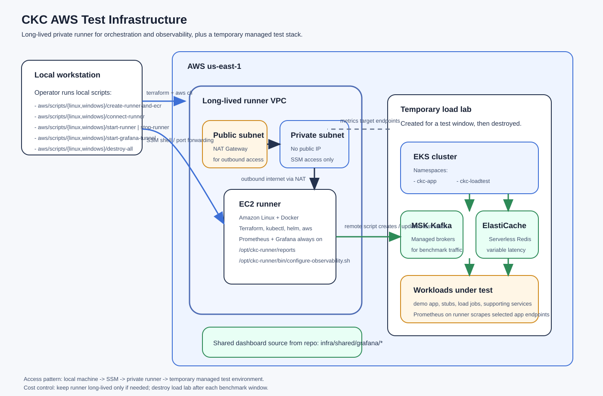

# AWS Infrastructure

`infra/aws` is now split by responsibility instead of by historical module name.

## Layout

- `terraform/`
  Long-lived Terraform stacks managed from the local machine.
  This currently holds `runner/` and `ecr/`.

- `assets/`
  AWS-only files uploaded to the runner by `update-runner`.
  This currently includes runner-side Terraform for disposable labs.

- `runner-internal/`
  Remote entrypoints that execute on the runner host.

- `../shared/`
  Helm charts, test definitions, and test orchestration code reused by AWS and local Kubernetes flows.

- `scripts/`
  Local operator commands split by OS:
  `scripts/linux/`
  `scripts/windows/`

## Model

- `terraform/runner`
  Creates the long-lived private EC2 runner.

- `terraform/ecr`
  Creates the long-lived ECR repositories.

- `assets/terraform`
  Defines the disposable AWS test lab synced to the runner.

- `runner-internal`
  Contains remote scripts that execute on the runner and orchestrate AWS lab lifecycle.

- `../shared/helm`
  Helm charts and deployment profiles for the app and stub workloads.

- `../shared/test-definitions`
  Test-run definitions that select deployment profiles and load configuration.

## Access Model

- The runner has no public IP.
- Shell access uses AWS Systems Manager Session Manager.
- Grafana and Prometheus are exposed locally through SSM port forwarding.
- Outbound internet access from the runner goes through a NAT gateway.
- The runner stores lab metrics outside the disposable EKS lab. Grafana keeps the datasource name/uid `Prometheus`, backed by a VictoriaMetrics-compatible remote-write receiver on the runner.
- `create-lab` installs a Grafana Alloy agent inside EKS. Alloy discovers `ckc-demo` pods through the Kubernetes API, scrapes `/actuator/prometheus`, and remote-writes pod-labelled metrics to the runner.
- The disposable lab Terraform creates same-account VPC peering, routes, and runner security-group ingress for the remote-write path. `destroy-lab` removes that networking with the lab.

## Typical Flow

1. Create the long-lived base with `create-runner-and-ecr`.
2. Build and push images from your workstation.
3. Create or reuse a lab from your workstation with `create-lab`.
4. Run one or more tests with `run-test`.
5. Inspect pod-aware metrics in Grafana through the runner tunnel.
6. Destroy the lab with `destroy-lab` when it is no longer needed. Metrics history remains on the runner.

See [terraform/README.md](/C:/Users/Alexey/code/coroutines-kafka-consumer/infra/aws/terraform/README.md) and [assets/README.md](/C:/Users/Alexey/code/coroutines-kafka-consumer/infra/aws/assets/README.md).
